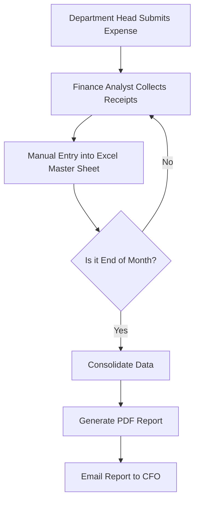
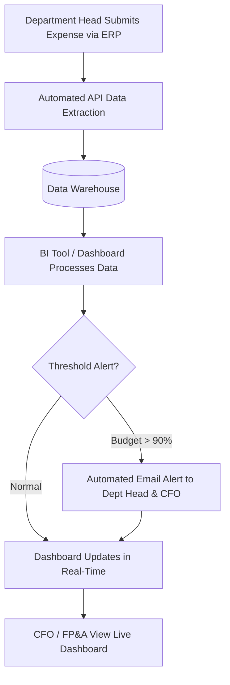

# Process Flow: Financial Expense Reporting

This document outlines the "As-Is" (current) process compared to the "To-Be" (proposed) automated process.

## As-Is Process (Manual)

## To-Be Process (Automated Dashboard)

